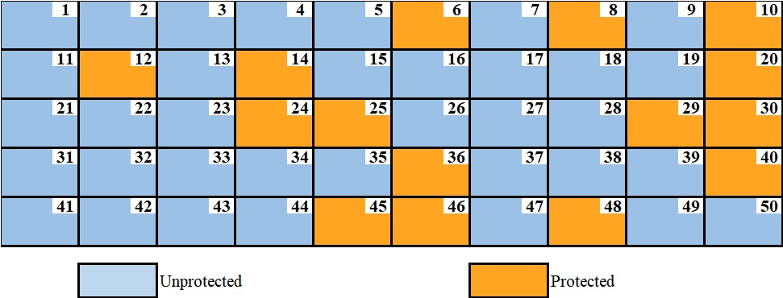
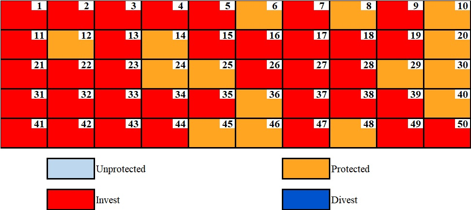
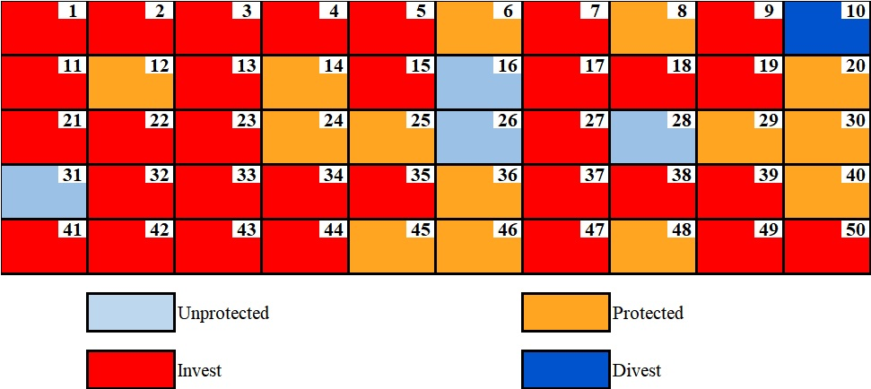
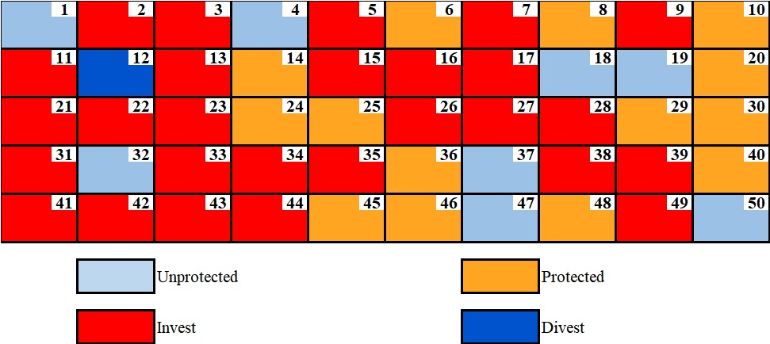
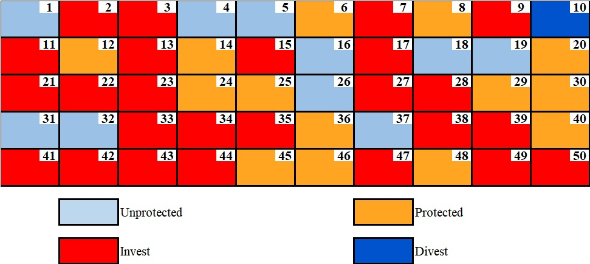
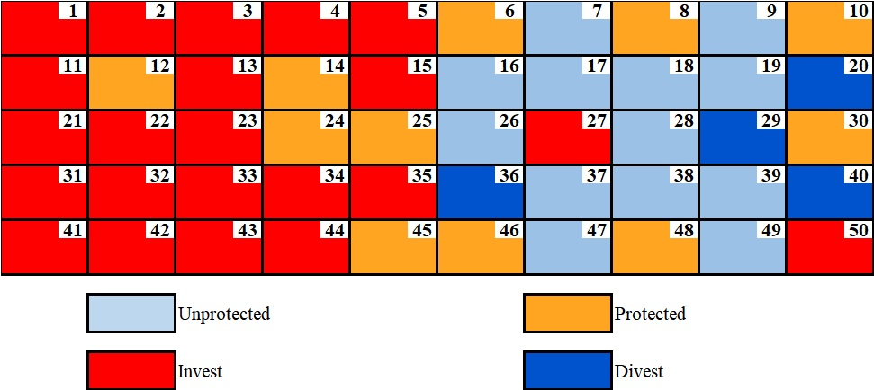
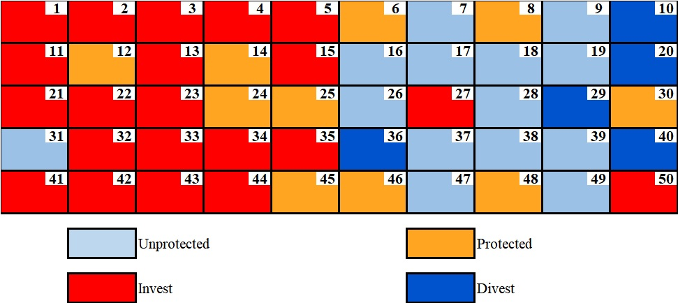

# SiteOpt v1.0.0: an Open-source R-package for Site Selection and Portfolio Optimization
**License**:  SiteOpt is an open source package and it is free for noncommercial use/research 

               https://github.com/paymanghasemi/SiteOpt/blob/master/SiteOpt%20Terms%20and%20Conditions.pdf

 
# Installation Guidelines (3 steps)
After opening each link, a download button will appear at the top right corner of the page.

1.  (**Mandatory**) Please read the following installation PDF file:

              https://github.com/paymanghasemi/SiteOpt/blob/master/Installation.pdf
     
       or watch the 8-min installation video (to install SiteOpt through RStudio):

               https://usf.box.com/s/5b167q17sxe0m9hmcozzf3es9wdpcmri 

  

2.  (**Mandatory**) Please download the suitable executable files, which contain SCIP and Julia, based on your computer characteristics through one of the following links: 

          Windows users: 
                https://usf.box.com/s/hkj2t1be3is0zcm8je1manze9k9gy6ob 
          Mac users:
                https://usf.box.com/s/llxl7jhbzpg7rtnr4tt9ray03p5i0hal 
          Linux users:
                https://usf.box.com/s/1iopiu6ssx3bkv34u6cd5cfs9ufqyjct  
3.  (Optional) If you prefer to replace SCIP with a powerful commercial solver such as CPLEX then watch the following 3-min video:  

                https://usf.box.com/s/8y4wodzpihuec0mihfr1zhswahonmd58 

# Usage Guidelines (2 steps)

1.  (**Mandatory**) Please download a simple example and watch its 3-min video through the following link in order to test SiteOpt: 

                https://usf.box.com/s/ldkslkm7mwlf3v19sq016pnkfz6mtxf4 

 

2.  (Optional) Please download and read the user manual for further information: 

                https://usf.box.com/s/125flpzjwexfub8lqfsyuyxcf1ez4k0y 
                
                
# Example
We  demonstrate  application  of  SiteOpt in different scenarios.

**Minimum Set Covering**: In the following script, we create and solve a random instance for the Minimum Set Covering problem defined in Section A.1.1 in Appendix A of the paper.
                
                https://usf.box.com/s/ljochmkq3afu1g805a5piayn2fvcjgxx

**Maximum Set Covering**: In the following script, we create and solve a random instance for the Maximum Set Covering problem defined in Section A.1.1 in Appendix A of the paper.

                https://usf.box.com/s/khn18htjxbhkra69jrrr9bvncl7nkwol

**50 Parcels Problem** We now solve the problem provided in Appendix C of the paper. The following figure represents the current status of the parcels in our example.

  

We mention that the investment and divestment will be done automatically in SiteOpt. This implies that if decision makers do not want to make any changes in a given parcel, then they should exclude the parcel from the data file. As soon as, a parcel is included in the data, SiteOpt can choose to divest it (if its current status is protected) or invest on it (if its current status is unprotected). Note that the result of SiteOpt is the optimal status for the parcels, i.e. whether they should be protected or not, and in order to realize the investments or divestments, users need to compare the initial status of the parcels with the resulted ones. In this case, investment means that the parcel was unprotected initially and it is protected in the optimal result, and divestment means that the parcel was protected initially and it is unprotected in the optimal result.

You can download the excel file of this example from the following link:
                
                https://usf.box.com/s/ohp590atcs0hq127tx9m85tg4z7cb89n
                
To load the SiteOpt in Rstudio as well as importing the example into Rstudio environment, use the following code in Rstudio (assuming the example's excel file is in "E:\Folder\Example.xlsx") :

          # Loading the SiteOpt library in R:
          library(SiteOpt)

          # Importing the information of Parcels, first objective function, and risk objective function:
          SiteOpt::Import_data(Address = "E:\\Folder\\Example.xlsx",First_Objective_Sense = "Max")

1.  **Scenario 1:** In this scenario, there is no constraint and SiteOpt attempts to simply maximize the First objective. To do so, run the following code:
              
          # Optimizes the first objective function regarding its defined sense (MAX)
          # The outcome of SiteOpt wil be stored in a list named Return
          Return<-SiteOpt::Optimize_First_Objective(Solver = "SCIP")

    The outcome of this scenario is trivial as SiteOpt will simply suggest to bring all parcels under protection. The result of SiteOpt for this scenario is shown in the           following image.

  

2.  **Scenario 2:** This scenario is similar to scenario 1, with the main difference being that SiteOpt considers the investment risk as the second objective function. 
    This scenario attempts to find a Nash bargaining solution to balance the tradeoffs between maximizing the First objective and minimizing risk. The code for this scenario is:
          
          # The outcome of SiteOpt wil be stored in a list named Nash
          Nash<-SiteOpt::Optimize_NBP(First_Objective = 1,Risk_Objective = 1,Solver = "SCIP")

    Although this scenario does not involve any constraint, its outcome is not trivial as it is not clear how to balance the tradeoffs. The result is provided in the following image.

  

3.  **Scenario 3:** In this scenario, we optimize the First objective and the Nash bargaining solution by considering a budget limit in the problem. To load the budget constraint from the excel file into the Rstudio environment and to find the optimal solutions, use the following code:

          # Importing the information of Budget constraint:
          SiteOpt::Budget_Import_Constraint(Address = "E:\\Folder\\Example.xlsx",Sheet = "Budget")

          # Optimize the First objective
          Return_Budget<-SiteOpt::Optimize_First_Objective(Solver = "SCIP")
          
          # Find the Nash bargaining Solution
          Nash_Budget<-SiteOpt::Optimize_NBP(First_Objective = 1,Risk_Objective = 1,Solver = "SCIP")
          
    Note that, as long as a constraint is in the RStudio's environemt, SiteOpt will automatically include its corresponding constraint in the problem. In order to exclude the constraint, you can attempt to remove it from the environment or change the name of the variable storing the constraint (refer to the manual). The result of optimizing the First objective given the budget constraint is provided in the following image.

  

        
   The Nash optimal solution between the First objective and Risk objective given the budget constraint is provided in the following image.

  

4.  **Scenario 4:** In this scenario, we optimize the First objective and the Nash bargaining solution by considering a spatial constraint in the problem in addition to the budget constraint. Note that, since the budget constraint was defined in the previous scenario, it still exists in the RStudio's environment. To load the spatial constraints from the excel file into the Rstudio environment and to find the optimal solutions, use the following code:

          # Importing the information of connectivity constraints:
          SiteOpt::Connectivity_Import_Constraint(Address = "E:\\Folder\\Example.xlsx", Sheet = "Connectivity")

          # Importing the information of disconnectivity constraints:
          SiteOpt::Disconnectivity_Import_Constraint(Address = "E:\\Folder\\Example.xlsx", Sheet = "Disconnectivity")

          # Optimize the First objective
          Return_Budget_Spatial<-SiteOpt::Optimize_First_Objective(Solver = "SCIP")
          
          # Find the Nash bargaining Solution
          Return_Budget_Spatial<-SiteOpt::Optimize_NBP(First_Objective = 1,Risk_Objective = 1,Solver = "SCIP")
          
    The result of optimizing the First objective given the budget and spatial constraints is provided in the following image.

  

        
   The Nash optimal solution between the First objective and Risk objective given the budget and spatial constraints is provided in the following image.

  

# Supporting and Citing

Ghasemi Saghand, P., Haider, Z., Charkhgard, H., Eaton, M., Martin, J., Yurek, S., Udell, B. J. (2021),  SiteOpt: an Open-source R-package for Site Selection and Portfolio Optimization. Ecography, minor revision.
